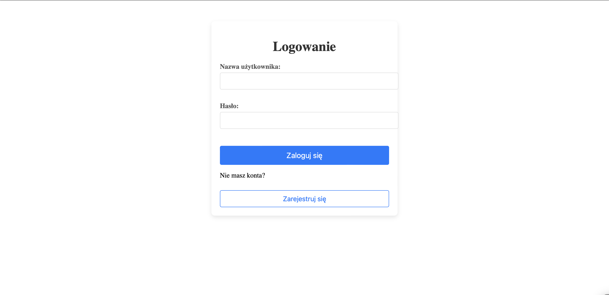
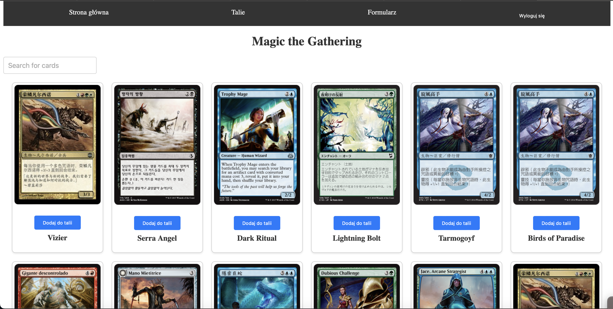

This project was created for the Introduction to Web Applications course at AGH WI in the 2024/2025 academic year.

# Description

The application is a tool created for fans of the game Magic: The Gathering, allowing intuitive and interactive management of cards and decks. Users can browse card details in a gallery, add them to their own decks, and share opinions about specific cards.

# Technologies Used

+ React.js
+ TypeScript
+ React Router
+ CSS

# Application Features

## User Authentication (Login and Registration)
Before accessing the main page, users must log in.
If they do not have an account, they can register using a dedicated form.

## Home Page – Card Browsing
Users can browse available cards, displayed as images along with basic information.

## Card Details
Clicking on a card opens a modal with details such as name, rarity, type, color, and price.
In the modal, users can also add opinions about the cards.

## Deck Management
Users can create new decks using a form available on the dedicated "Decks" page.
Once a deck is created, users can add cards to it from the gallery.

## Adding Cards to a Deck
By clicking on a card, users can select a deck to which they want to add it.
After adding a card, it is assigned to the chosen deck, and the application state is updated accordingly.

## Contact Form
The application includes a form allowing users to send messages to the email address: stronamagicwdai@gmail.com.
This form can be used to report feedback or suggestions related to the application.

## Navigation Between Sections
The application allows easy switching between pages: Home, Decks, and Contact Form, using navigation visible at the top of the page.
The navigation is styled and dynamic, ensuring smooth transitions between sections.

# Preview

## Login

## Home page

